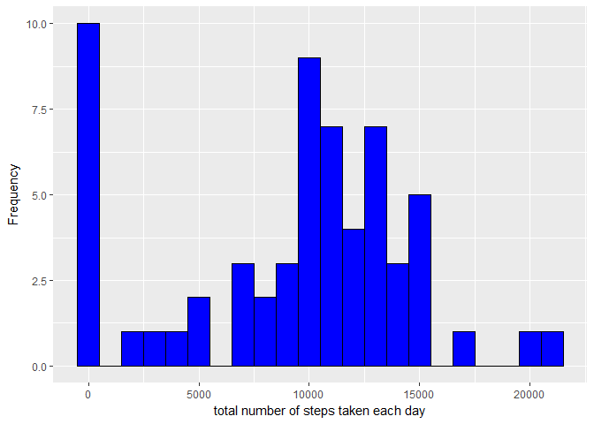
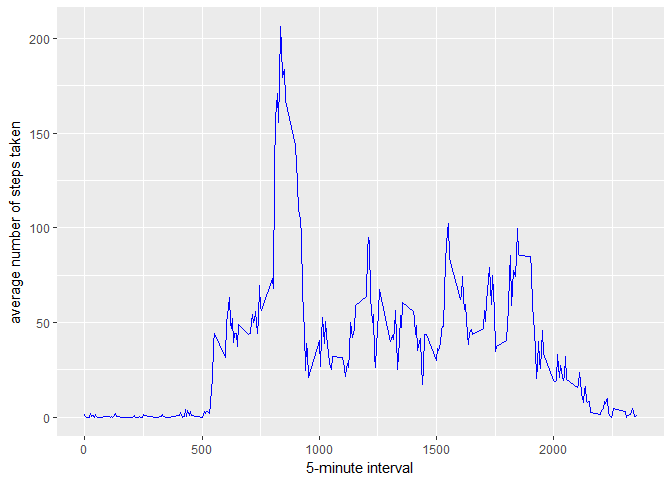
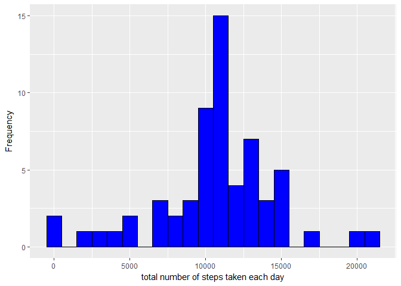
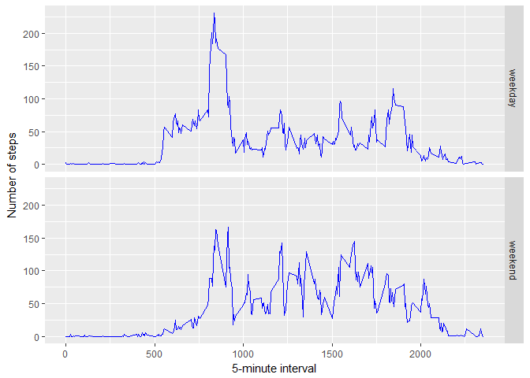

# Reproducible Research: Peer Assessment 1
PanMud  
September 30, 2017  


## Loading and preprocessing the data


```r
suppressPackageStartupMessages(library(dplyr))
# Unzip archive
unzip("activity.zip")

# Read base data into a data frame.
activity <- read.csv("activity.csv")

# Data Dimensions
dim(activity)
```

```
## [1] 17568     3
```

```r
# Data Summary
summary(activity)
```

```
##      steps                date          interval     
##  Min.   :  0.00   2012-10-01:  288   Min.   :   0.0  
##  1st Qu.:  0.00   2012-10-02:  288   1st Qu.: 588.8  
##  Median :  0.00   2012-10-03:  288   Median :1177.5  
##  Mean   : 37.38   2012-10-04:  288   Mean   :1177.5  
##  3rd Qu.: 12.00   2012-10-05:  288   3rd Qu.:1766.2  
##  Max.   :806.00   2012-10-06:  288   Max.   :2355.0  
##  NA's   :2304     (Other)   :15840
```


## What is mean total number of steps taken per day?


```r
suppressPackageStartupMessages(library(ggplot2))
total.steps <- tapply(activity$steps, activity$date, FUN=sum, na.rm=TRUE)
qplot(total.steps, binwidth=1000, xlab="total number of steps taken each day", ylab="Frequency",
      fill=I("blue"), col=I("black"))
```

<!-- -->


mean of the total number of steps taken per day


```r
mean(total.steps, na.rm=TRUE)
```

```
## [1] 9354.23
```

median of the total number of steps taken per day


```r
median(total.steps, na.rm=TRUE)
```

```
## [1] 10395
```

## What is the average daily activity pattern?


```r
suppressPackageStartupMessages(library(ggplot2))
averages <- aggregate(x=list(steps=activity$steps), by=list(interval=activity$interval),
                      FUN=mean, na.rm=TRUE)
ggplot(data=averages, aes(x=interval, y=steps)) + geom_line(color="blue")  + 
       xlab("5-minute interval") + ylab("average number of steps taken")
```

<!-- -->

Which 5-minute interval, on average across all the days in the dataset, contains the maximum number of steps?


```r
averages[which.max(averages$steps),]
```

```
##     interval    steps
## 104      835 206.1698
```

## Imputing missing values

total number of missing values in the dataset 


```r
missing <- is.na(activity$steps)
# How many missing
table(missing)
```

```
## missing
## FALSE  TRUE 
## 15264  2304
```

Fill the missing values with mean value for that 5-minute interval.


```r
# Replace each missing value with the mean value of its 5-minute interval
fill.value <- function(steps, interval) {
    filled <- NA
    if (!is.na(steps))
        filled <- c(steps)
    else
        filled <- (averages[averages$interval==interval, "steps"])
    return(filled)
}
cleanData <- activity
cleanData$steps <- mapply(fill.value, cleanData$steps, cleanData$interval)
```


Make a histogram of the total number of steps taken each day and calculate the mean and median total number of steps.


```r
total.steps <- tapply(cleanData$steps, cleanData$date, FUN=sum)
qplot(total.steps, binwidth=1000, xlab="total number of steps taken each day", ylab="Frequency", fill=I("blue"), 
      col=I("black"))
```

<!-- -->

mean of the total number of steps taken per day in the new dataset


```r
mean(total.steps, na.rm=TRUE)
```

```
## [1] 10766.19
```

median of the total number of steps taken per day in the new dataset


```r
median(total.steps, na.rm=TRUE)
```

```
## [1] 10766.19
```

## Are there differences in activity patterns between weekdays and weekends?


Ientify the the weekend and weekdays in the data


```r
  wdaywend <- function(date) {
    day <- weekdays(date)
    if (day %in% c("Monday", "Tuesday", "Wednesday", "Thursday", "Friday"))
        return("weekday")
    else if (day %in% c("Saturday", "Sunday"))
        return("weekend")
    else
        stop("invalid date")
}
cleanData$date <- as.Date(cleanData$date)
cleanData$day <- sapply(cleanData$date, FUN=wdaywend)
```

Plot the number of steps based on the weekday or weekend


```r
averages <- aggregate(steps ~ interval + day, data=cleanData, mean)
ggplot(averages, aes(interval, steps)) + geom_line(color="blue")  + facet_grid(day ~ .) +
    xlab("5-minute interval") + ylab("Number of steps")
```

<!-- -->


Note that there seems to be a variation in the activity patterns between weekdays and weekends.

